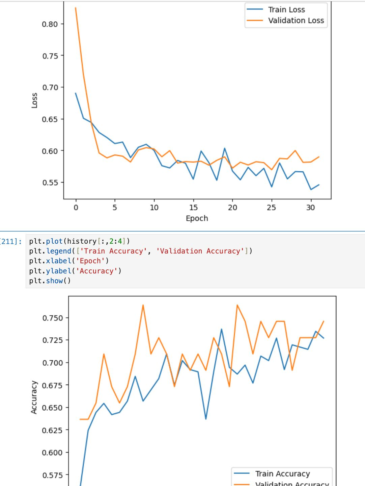

# redes_neurais_SCC0270

INTRODUÇÃO

Este repositório se refere a entrega final da disciplina. A atividade tinha como objetivo desenvolver e treinar uma rede neural capaz de classificar radiografias de tórax entre imagens não doentes e imagens de pacientes diagnosticados com COVID-19. O conjunto de dados utilizado está publicamente disponível em: https://github.com/ieee8023/covid-chestxray-dataset.  

Trata-se de um problema de classificação binária: com COVID-19 (label 0), 342 imagens; saudável (label 1): 193 imagens.
O dataset apresenta um leve desbalanceamento entre as classes (cerca de 65% - 35%), o que é importante destacar para os próximos passos.

Esse repositório está organizado da seguinte forma: cada arquivo tem, em seu nome, as redes que foram treinadas ali, na mesma ordem em que estão no código. Cada uma está organizada dentro de um tópico, ou índice, dentro do notebook, de maneira a facilitar sua localização. 
Os preâmbulos dos arquivos são os mesmos para os notebooks (importação dos dados + funções gerais, como treino e validação). 
Os arquivos podem ser consultados em qualquer ordem, mas sugerimos seguir a ordem cronológica com que trabalhamos, descrita a seguir. Para facilitar essa consulta em particular, descrevemos no final desse README.md a sequência de arquivos a serem consultados e quais redes devem ser consultadas em cada, Buscamos organizar da melhor forma para facilitar a compreensão.

DESENVOLVIMENTO

O projeto teve início com a definição de um modelo simples, composto por duas camadas convolucionais seguidas de uma camada totalmente conectada, com o objetivo de realizar uma primeira experimentação e exploração do comportamento do problema. Os resultados obtidos foram bastante insatisfatórios, o que nos motivou a explorar o lado oposto dessa régua e testar abordagens sofisticadas.

Avançamos, então, para o uso de modelos robustos, aplicando a técnica de transfer learning. Nessa etapa, trabalhamos congelando os parâmetros das camadas convolucionais e readequando apenas os parâmetros das camadas densas. Optamos por redes da família DenseNet e ResNet, tendo em vista que, segundo a literatura consultada (artigos de revisão), essas arquiteturas são amplamente utilizadas em problemas semelhantes de classificação de imagens médicas. Ao todo, experimentamos três variantes da DenseNet e três da ResNet.

Apesar dos ajustes e testes realizados, os resultados continuaram insatisfatórios. Observamos que a função de perda praticamente não apresentava variações significativas durante o treinamento, e as métricas de desempenho indicavam que o modelo não estava aprendendo padrões de interesse: a acurácia se mantinha próxima de 65% (valor compatível com o desbalanceamento das classes), o recall era consistentemente nulo e a precisão igual a um, o que indicava que a rede estava apenas memorizando os exemplos negativos, "chutando" . Testamos diferentes taxas de aprendizado, incluindo valores altos e baixos, mas as oscilações observadas não resultaram em melhoria consistente no desempenho. Também avaliamos outras funções de perda, funções de ativação e até otimizadores, mas os resultados permaneceram insatisfatórios.

Junto ao professor, levantamos a hipótese de que as conexões residuais das arquiteturas testadas poderiam estar propagando features irrelevantes para o nosso contexto específico. Isso seria plausível, considerando que os modelos pré-treinados dispoíveis no Pytorch foram originalmente treinados no dataset ImageNet, que contém imagens de alta variedade, como mamíferos, veículos e outros objetos cotidianos, bastante distintos de radiografias de tórax.

Paralelamente, buscamos desenvolver, também, arquiteturas mais complexas do zero. Embora não tivéssemos muitas expectativas, já que o tamanho do dataset era pequeno demais, quisemos explorar essa possibilidade porque, de acordo com nossa principal referência bibliográfica, redes "custom made", como chamamos elas, são muito usadas nesse contexto, tanto quanto transfer learning de redes prontas. No entanto, ao invés de definir uma arquitetura do zero "no escuro", buscamos mais referências de arquiteturas que apresentaram bons resultados no mesmo problema ou em problemas semelhantes, e buscamos implementar e treinar elas, ou uma arquitetura inpirada nessas. Ainda assim, os resultados não foram muito diferentes do que já tínhamos conseguido. 

Retomando as hipóteses surgidas nos testes com as famílias DenseNet e ResNet, diante da possível limitação referente ao contexto, buscamos por modelos pré-treinados em domínios mais semelhantes ao nosso. Encontramos, então, a arquitetura CheXNet (https://github.com/arnoweng/CheXNet/tree/master) e também a biblioteca torchxrayvision (https://mlmed.org/torchxrayvision/), que oferecem modelos treinados especificamente em grandes conjuntos de radiografias e que, portanto, seguindo o hipótese levantada, extrairiam features mais relevantes para esse tipo de imagem médica.

Na primeira abordagem, utilizamos a técnica de transfer learning tradicional, e na segunda, aplicamos tanto o transfer learning tradicional quanto o fine-tuning, retreinamento, além da camada densa, a última camada convolucional. Embora os resultados obtidos ainda não tenham sido satisfatórios, observamos alguns progressos relevantes.

Na primeira arquitetura testada, não conseguimos promover melhorias no desempenho. O comportamento do modelo permaneceu extremamente estável durante todo o treinamento, sem avanços perceptíveis. O transfer learning tradicional aplicado na segunda arquitetura apresentou resultados semelhantes. No entanto, o fine-tuning dessa segunda arquitetura revelou-se uma abordagem mais promissora.

Apesar de as métricas de avaliação não terem apresentado avanços significativos em comparação com os cenários anteriores, as curvas de aprendizado indicaram potencial. A função de perda apresentou uma leve, porém consistente, tendência de decaimento, tanto nos dados de treino quanto de validação, com trajetórias próximas e paralelas. Da mesma forma, a curva de acurácia demonstrou crescimento lento, mas estável, para ambos os conjuntos. Esses resultados sugeriam que o modelo poderia eventualmente convergir para um desempenho melhor, mas não foi possível dar continuidade ao experimento devido a limitações computacionais. O tempo de treinamento era excessivamente longo e seriam necessárias muitas épocas adicionais para observar mudanças mais substanciais no comportamento do modelo. Assim, continuamos explorando abordagens possíveis.

Diante disso, decidimos retomar o modelo simples desenvolvido no início para aprimorar e aprofundar essa arquitetura básica com base nos aprendizados obtidos ao longo das tentativas anteriores. No entanto, mesmo com os ajustes realizados, não obtivemos avanços significativos.

Começamos a identificar um padrão recorrente: os modelos mais simples, como as redes manuais que desenvolvemos, não conseguiam aprender as particularidades do problema e tendiam a prever sempre a classe majoritária. Por outro lado, as arquiteturas mais complexas, baseadas em transfer learning, apresentavam overfitting com muita facilidade.
Dessa forma, concluímos que seria necessário buscar uma solução intermediária, capaz de equilibrar a complexidade inerente ao problema e o tamanho reduzido do conjunto de dados. Para isso, selecionamos duas arquiteturas: ResNet-18 e ResNet-34, e nos concentramos no ajuste fino dos seus hiperparâmetros.

Finalmente obtivemos resultados mais promissores! Conseguimos fazer com que a rede começasse, de fato, a aprender, superando o problema de underfitting que observávamos nas redes mais simples. Além disso, havia margem para otimização antes que o modelo começasse a apresentar overfitting. Os desempenhos médios melhoraram em torno de 10% em relação às tentativas anteriores.

Apesar da evolução, as redes ainda entraram em overfitting antes de alcançarem uma performance plenamente satisfatória. No entanto, essas experimentações foram guias importantes para os próximos passos. Decidimos seguir com uma estratégia incremental, explorando arquiteturas próximas dessas, porém mais leves. Testamos a SqueezeNet, mas ela voltou a apresentar comportamento de underfitting, se mostrando excessivamente simples.

Dando continuidade à busca pelo "ponto de equilíbrio", experimentamos outras arquiteturas intermediárias, incluindo GoogLeNet, ShuffleNet e, por fim, MobileNetV2, com resultados progressivamente melhores em cada. A MobileNetV2 destacou-se como a melhor solução encontrada, atingindo 80% de acurácia na validação, a melhor performance obtida ao longo de todo o projeto, e curvas de perda bem comportadas.

Curva da MobileNetV2: 

Melhores métricas: 
Epoch: 8/35 
	Training: Loss - 0.0250, Accuracy - 98.9975%, 
	Validation : Loss - 0.9580, Accuracy - 80.0000%, Recall - 0.6500
